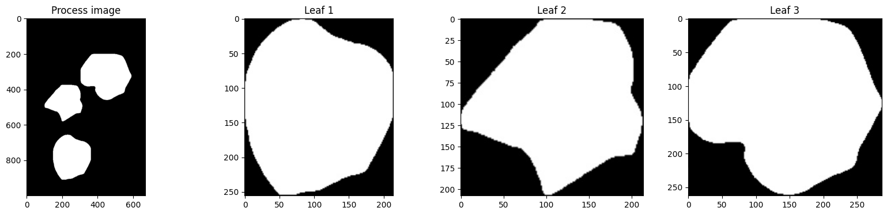
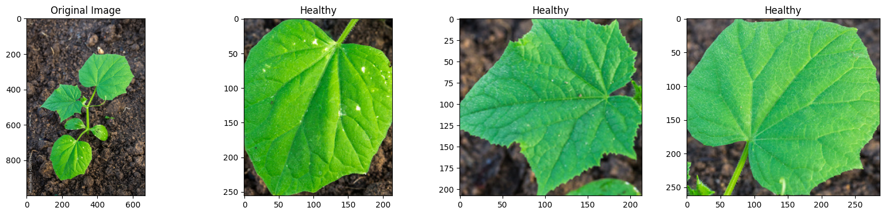
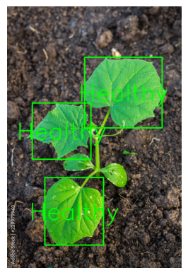

# Disease-Leaf-2-Layer-Detector

งานนี้เป็นส่วนหนึ่งของโครงการ iRAIC2023 (Innovation Robotic AI & IOT Contest 2023) ที่จัดโดยมหาวิทยาลัยเกษตรศาสตร์ และได้รับรางวัลรองชนะเริศอันดับ 2 ในหัวข้อ ออกแบบระบบ IoT System สำหรับระบบเกษตร แม่นยำสูง (Precision Agriculture)

โดย Project จะเกี่ยวกับการสร้าง DashBoard ที่ติดตามค่าสถานะต่างๆของฟาร์ม เช่น อุณหภูมิ ความชื้น ความสว่าง รวมถึงการใช้ Deep learning มาประยุกต์ใช้เข้ากับ smart farm เพื่อให้มีประสิทธิภาพมากยิ่งขึ้น

ชื่อทีม: El gato

## Dashboard

DashBoard ที่เราเลือกใช้คือ Grafa ([grafana.com](https://grafana.com)) ซึ่งสามารถใช้ได้ดีกับข้อมูลประเภท Real-Time

## Sensor

Sensor ทั้งหมดที่เลือกจะแสดงผลมี 7 ตัวได้แก่
- Camera Board for Raspberry Pi
- เซ็นเซอร์วัดระดับน้ำ
- เซ็นเซอร์วัดอุณหภูมิน้ำ
- เซ็นเซอร์วัดอุณหภูมิโรงเรือน
- เซ็นเซอร์วัดความชื้นในโรงเรือน
- เซนเซอร์วัดค่า PH
- เซนเซอร์วัดค่า ec
- เซนเซอร์วัดค่า tds

## Microcontroller
- Raspberry Pi 4
- NodeMCU
    
## Dataset
พืชที่ใช้สำหรับการทดสอบคือแตงกวาจึงต้องหา Dataset สำหรับใบแตงกวาสำหรับการ train
Dataset ที่ใช้สำหรับ train แบ่งออกได้เป็น 2 ส่วน:
- [Greenhouse Cucumber Growth Stages](https://www.kaggle.com/datasets/farahseifeld/greenhouse-cucumber-growth-stages) (for Object detection model)
- [Dataset on Mendeley](https://data.mendeley.com/datasets/y6d3z6f8z9/1) (for Classifier model) 

## Model
- Object detection model ใช้สำหรับตรวจจับใบเพื่อเพิ่มความแม่นยำในการแยก label และ model ที่ใช้คือ YOLOv8 ([GitHub Repository](https://github.com/ultralytics/ultralytics))
    
    
- Classifier model หลังจากแยกใบเราจะใช้ model ตัวนี้สำหรับแยกระหว่างใบที่ Healthy และ Unhealthy
    

## Last Result  

